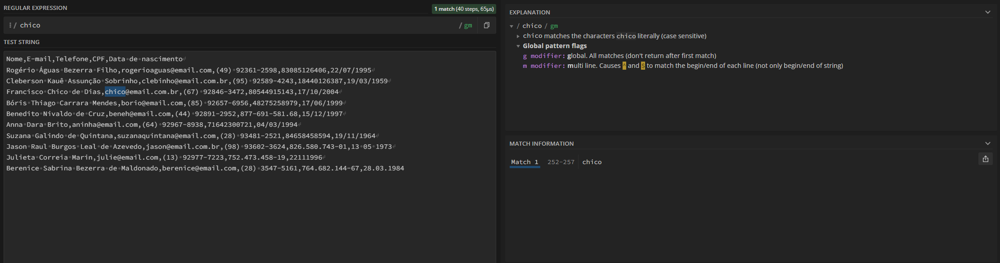
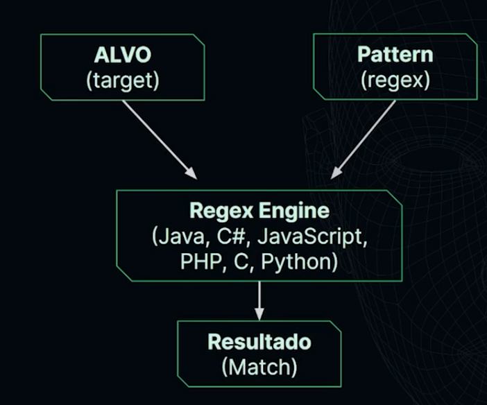
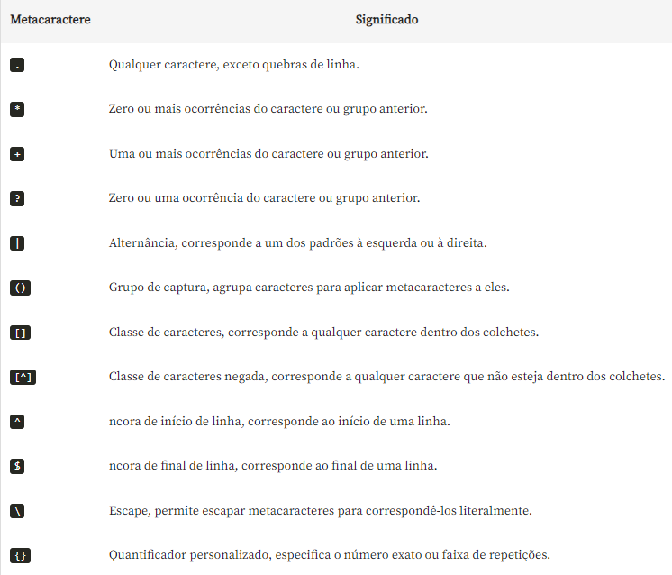

# Regex

# estudo 1.1

[Ferramenta para testar regex online](https://regex101.com)

# estudo 1.3

## O que são regex:

Regex, ou expressões regulares, são sequências de caracteres que formam um padrão de busca. São usados para manipular dados com base no padrão estabelecido, para encontrar, validar ou extrair dados específicos.

## Buscas literais:

O regex aceita buscas literais, que você pede diretamente o que você deseja:

### exemplo:



# estudo 1.5

## Buscas regex no terminal:

**Comando linux:**

```
$ grep [regex] [path]
```

**GREP:** Global Regular Expression Print.

## Processos da regex:



Outro termo para referenciar a regex engine é flavor.

# estudo 1.6

## Comandos regex no linux:

1. **Comando `grep`:** Utilizado para buscar texto em arquivos ou na saída de outros comandos, usando expressões regulares para localizar padrões específicos.

   - Exemplo: `grep [opções] [regex] caminho_do_arquivo.txt`
   - Opções comuns:
     - `-i` (ignora maiúsculas/minúsculas)
     - `-v` (inverte a correspondência)
     - `-r` (pesquisa recursiva)
     - `-l` (mostra arquivos com correspondências)
     - `-c` (conta as correspondências)
     - `-n` (exibe números das linhas)
     - `-E` (expressões regulares estendidas)
     - `-f` (lê padrões de um arquivo)
     - `-P` (expressões regulares Perl)
   - `man grep` exibe a documentação do comando.

2. **Comando `sed`:** Usado para manipular arquivos de texto, como substituir sequências de caracteres com base em expressões regulares.

   - Exemplo: `sed 's/regex/novo_texto/g' caminho_do_arquivo.txt`

3. **Comando `awk`:** Uma linguagem de programação para processamento de texto que permite aplicar expressões regulares e manipular dados.

   - Exemplo: `awk '/regex/ {print $1}' caminho_do_arquivo.txt`

## Comandos regex no Windows:

O comando `findstr` no terminal Windows permite buscar texto em arquivos ou na saída de outros comandos, com suporte a expressões regulares básicas usando a opção `/r`. Exemplo: `findstr /r "padrão_regex" arquivo.txt`.

No PowerShell, o suporte a expressões regulares é completo, podendo-se usar o operador `-match` para verificar se uma string corresponde a um padrão. Exemplo: `Get-Content arquivo.txt | ForEach-Object { if ($_ -match "padrão_regex") { $_ } }`.

# estudo 1.7

## Regex e js

Para indicar no javascript uma regex o termo deve estar entre barras (/ /): `const regex = /[regex]/;`.

Para pegar o resultado de uma regex se utiliza o o método `match` de string do javascript`String.match([regex]);` .

# estudo 1.8

## Metacaracteres:

**Dígitos:** Para indicar que a regex deve pegar um dígito (0, 1, 2, 3, 4, 5, 6, 7, 8, 9) se utiliza: `/\d/`.

**Sequênicas:** Para indicar sequênicias no regex se utiliza o `+`, como por exemplo para indicar uma sequência de dígitos: `/\d+/`.

**Selecionar vários:** Para indicar que a regex deve se pegar todos os termos compatíveis se utilza `/[regex]/g` com o **g** no final, como por exemplo: `/d+/g`;

**Espaços**: Para indicar que um espaço em uma regex se utiliza: `\s`.

**Parênteses literais:** Para indicar parênteses literais nas regex: `\(` + regex que indica o conteúdo dentro do parênteses +`\)` = `/\([regex]\)/`

# estudo 1.10



# estudo 2.1

## Quantificadores

Para indicar que algo deve se repetir um número finito de vezes utiliza-se: `{n}` ao invés de `+`, como por exemplo para pegar uma sequência de dois dígitos ficaria `/d{2}/`. Para indicar uma faixa de trabalho se utiliza vírgula dentro das chaves, como por exemplo pegar uma sequência entre dois e quatro dígitos ficaria `/d{2,4}/`.
