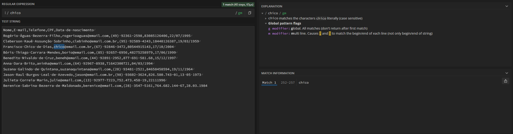

# estudo 1.1

[Ferramenta para testar regex online](https://regex101.com)

# estudo 1.3

## O que são regex:

Regex, ou expressões regulares, são sequências de caracteres que formam um padrão de busca. São usados para manipular dados com base no padrão estabelecido, para encontrar, validar ou extrair dados específicos.

## Buscas literais:

O regex aceita buscas literais, que você pede diretamente o que você deseja:

### exemplo:

